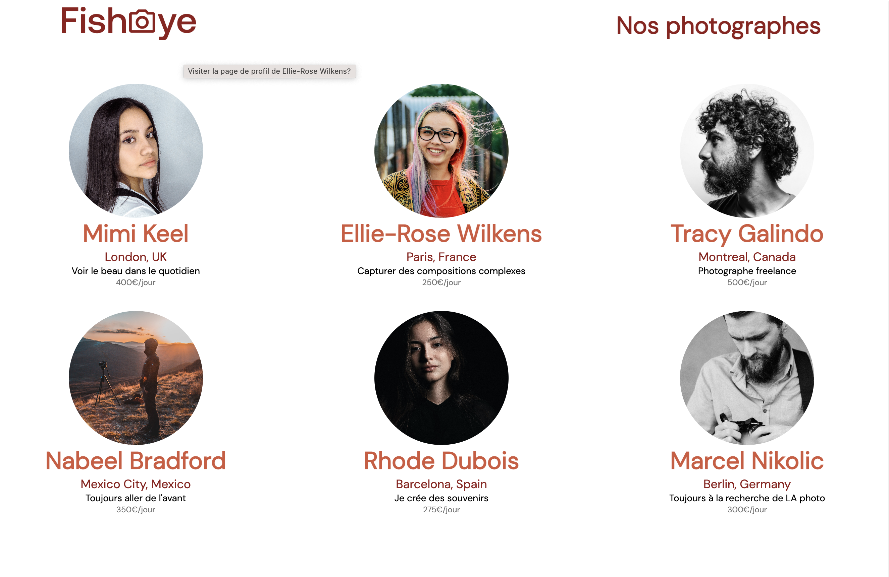

# FISHEYE - Photographers Activities Website

### Author Links

👋 Hello, I'm Hordofel Dusty BAMANA.

👇 Follow Me:

- [Twitter](https://twitter.com/hordofel)
- [LinkedIn](https://www.linkedin.com/in/dusty-hordofel-bamana-08389310a)

---

### 🚀 Description

HBD .... comment .....

---

### NB: This project has already been done using functional programming. For compliance reasons, it is redone in the Factory pattern used in OOP. The CSS of the first project will therefore be copied and pasted.

---

## Demo



<!--  -->

---

## Section 1. Setup

---

### 1. import Project from GitHub

- clone a github repository named `https://github.com/OpenClassrooms-Student-Center/Front-End-Fisheye.git`
- understand and test all scripts in the project
- create a setup branch `Setup` in github repository to save the setup folder structure

---

## Section 2. Import Data

### 2. fetch data from JSON file

- create a [photographersApi](./js/api/photographersApi.js) `class`

```js
//Create Api class to fetch data from api

class Api {
  //Use of the constructor function to create similar objects. It is a special method for creating and initializing an object created within a class.
  constructor(url) {
    this._url = url;
  }

  async get() {
    try {
      const response = await fetch(this._url);
      const data = await response.json();
      return data;
    } catch (error) {
      console.log(
        "🚀 ~ file: photographersApi.js:12 ~ Api ~ get ~ error:",
        error
      );
    }
  }
}

// photographersApi class extends Api class to fetch data from api
class photographersApi extends Api {
  constructor(url) {
    super(url);
  }

  getPhotos() {
    return this.get();
  }
}
```

- create [photographerCard](./js/templates/photographerCard.js)

```js
class PhotographerCard {
  //Use of the constructor function to create similar objects. It is a special method for creating and initializing an object created within a class.
  constructor(informations, element) {
    this.informations = informations;
    this.element = element;
  }

  //Create the createCards function to create the cards of the photographers
  createCards() {
    this.element.innerHTML = this.informations
      .map((information) => {
        const { city, country, id, name, portrait, price, tagline } =
          information;
        return `
    <article class="photoraher-profile" aria-label="Informations sur le photographe ${name} tabindex="0">
    <a href="photographer.html?id=${id}" title="Visiter la page de profil de ${name}" role="link">
    
    <h2>${name}</h2>
    </a>
    <p class="location" aria-label="ville et pays où se trouve le photographe">${city}, ${country}</p>
    <p class="description" aria-label="citation du photographe:${name}">${tagline}</p>
    <p class="price" aria-label="coût de la prestation du photographe ${name}">${price}€/jour</p>
    </article>
    `;
      })
      .join("");
  }
}
```

- use [photographersApi](./js/api/photographersApi.js) && [photographerCard](./js/templates/photographerCard.js) in [index](./js/pages/index.js)

```js
class IndexApp {
  //Use of the constructor function to create similar objects. It is a special method for creating and initializing an object created within a class.
  constructor() {
    this.$photographersSection = document.querySelector(
      ".photographer_section"
    );

    this.photographersApi = new photographersApi("/data/photographers.json");
  }

  async main() {
    //Retieve data from api
    const photographersData = await this.photographersApi.getPhotos();

    //Use destructuring to retrieve utile data
    const { media, photographers } = photographersData;

    //Create ann instance of PhotographerCard to display photographers
    new PhotographerCard(
      photographers,
      this.$photographersSection
    ).createCards();
  }
}

//Create an instance of IndexApp and call main method
const app = new IndexApp();
app.main();
```

- add [Home Page](./css/style.css)

```css
/************************************/
/* GOOGLE FONTS */
/************************************/
@import url("photographer.css");

/************************************/
/* CUSTOM PROPERTY*/
/************************************/
:root {
  --max-width: 144rem;
}

/************************************/
/* Global Styles */
/************************************/

body {
  font-family: "DM Sans", sans-serif;
  margin: 0;
}

header {
  display: flex;
  align-items: center;
  justify-content: space-between;
  /* background: rosybrown; */
  animation: fadeOut 4s ease-in-out forwards;
  animation-delay: 1s;
  transition: 0.1s ease-in;
  padding-top: 40px;
}

h1 {
  color: #901c1c;
}

header h1 {
  text-align: end;
}

.logo {
  height: 50px;
}

.section-center {
  width: 90vw;
  max-width: var(--max-width);
  margin: 0 auto;
}

.photographer_section {
  display: grid;
  grid-template-columns: repeat(3, 1fr);
  gap: 70px;
  margin-top: 100px;
  margin-bottom: 115px;
  animation: fadeOut 3s ease-in-out forwards;
  animation-delay: 1s;
  transition: all 0.3s ease-in-out;
}
main {
  max-width: var(--max-width);
  width: 100%;
  margin: 0 auto;
  transition: all 0.2s ease-in;
}

@media screen and (max-width: 1053px) {
  .photographer_section {
    grid-template-columns: repeat(2, 1fr);
  }
}

@media screen and (max-width: 700px) {
  .photographer_section {
    grid-template-columns: 1fr;
  }
}

@media screen and (max-width: 800px) {
  header {
    flex-direction: column;
  }

  header a {
    display: flex;
    justify-content: center;
  }

  header img {
    justify-content: center;
  }

  header h1 {
    width: 100%;
    text-align: center;
  }
}

@keyframes fadeOut {
  0% {
    opacity: 0;
  }

  25% {
    opacity: 0.25;
  }
  50% {
    opacity: 0.5;
  }

  75% {
    opacity: 0.75;
  }

  100% {
    opacity: 1;
  }
}

.photographer_section article {
  justify-self: center;
  display: flex;
  justify-content: center;
  align-items: center;
  flex-direction: column;
}

.photographer-header-title {
  font-weight: 400;
}

/************************************/
/* Photographe header */
/************************************/

.photoraher-profile {
  display: flex;
  align-items: center;
  justify-content: center;
  /* background: thistle; */
}
.photographer_section article h2 {
  color: #d3573c;
  font-size: 36px;
  margin-bottom: 0;
  font-weight: 400;
}

.photographer_section article img {
  height: 200px;
  width: 200px;
  border-radius: 50%;
  object-fit: cover;
  margin-bottom: 20px;
}

.photographer_section .location {
  color: #901c1c;
  margin-bottom: 0;
}
.photographer_section .price {
  color: #757575;
}
.photographer_section .description {
  margin-bottom: 0;
  /* background: yellow; */
}
.photographer_section a {
  text-decoration: none;
  display: block;
  /* background: #901c1c; */
  display: flex;
  flex-direction: column;
  justify-content: center;
  align-items: center;
}

/************************************/
/* Photographe loader */
/************************************/

.loader {
  width: 100%;
  height: 100vh;
  background-color: white;
  display: flex;
  flex-direction: column;
  justify-content: center;
  align-items: center;
  position: fixed;
  z-index: 10;
}

.container {
  display: flex;
}

.dot,
.shadow {
  width: 50px;
  height: 50px;
  background-color: #901c1c;
  border-radius: 25px;
  margin: 0 4px;
}

.shadow {
  opacity: 0.3;
}
```
